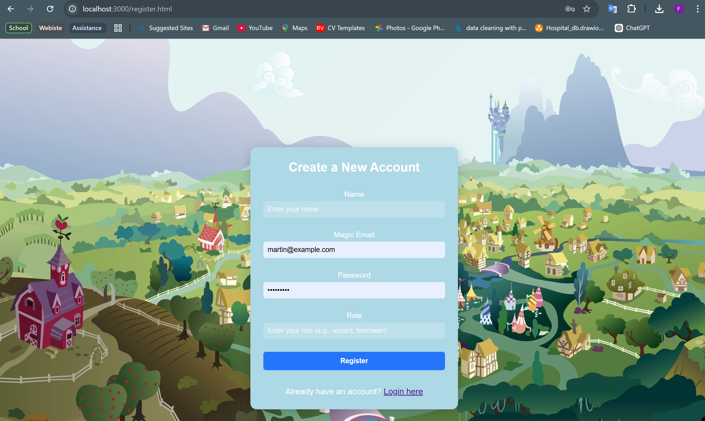

# The Loan Wizard - Documentation

## Overview
The Loan Wizard is a web application that allows users to manage loans, track repayments, and view transaction histories in a fun and whimsical fantasy-themed environment. It also enables users to calculate loan interest rates and repayment schedules.

The application includes features like user registration, loan management, interest rate tracking, repayment management, and transaction history, all while ensuring user authentication and data security.

## Features
- **User Registration**: Users can sign up with their personal information to access the app.
- **Loan Management**: Users can apply for loans, view loan details, and track repayment schedules.
- **Interest Rate Tracking**: Admins can manage loan interest rates and update them as needed.
- **Repayment Management**: Users can make repayments and track them over time.
- **Transaction History**: Users can view their transaction history and see all past activities in a table format.
- **Authentication**: Users must log in to access their data, ensuring security and privacy.

## Technologies Used
- **Node.js**: Backend runtime environment.
- **Express.js**: Web framework to build the RESTful API.
- **MySQL**: Relational database for storing user, loan, and transaction data.
- **Session Management**: Express sessions for managing authentication and user sessions.
- **dotenv**: To manage environment variables securely.
- **CORS**: To enable cross-origin requests for the frontend.
- **CSS & HTML**: For the front-end styling and structure.

## API Endpoints
- **POST /api/users**: Register a new user.
- **POST /api/login**: Log in an existing user.
- **GET /api/users/me**: Get the currently authenticated user's data.
- **POST /api/loans**: Apply for a new loan.
- **GET /api/loans**: View a list of the user's loans.
- **POST /api/repayments**: Make a repayment.
- **GET /api/transactions**: View a list of all transactions.

## Authentication
The app uses session-based authentication. When a user logs in, their session is stored on the server, and the user is authenticated for further requests.

## Setting Up the Application Locally

### Prerequisites
Before setting up the app locally, make sure you have the following installed:
- **Node.js** (v14 or higher)
- **MySQL** (v8 or higher)
- **npm** (Node Package Manager)

### Installation

1. **Clone the Repository**:
   ```bash
   git clone [https://github.com/Newbie4newthings/Newbie4newthings-Database-Design-Programming-with-SQL-V2-Final-Project.git]
   cd loan-wizard
2. **Install Dependencies**:Inside the project directory, install the required Node.js dependencies:
    ```bash
    Copy code
    npm install
3. **Set Up Environment Variables:**:Create a .env file in the root directory of the project and add the following variables:
    SESSION_SECRET= your_secret_key
    DB_HOST= localhost
    DB_USER= your_db_user
    DB_PASSWORD= your_db_password
    DB_NAME= your_db_name
    CORS_ORIGIN= http://localhost:3000
    PORT=3000
4. **Set Up MySQL Database:**:
    Open your mySql workbench and paste the loan_wizard Creation Code.sql to create the database 

5. **Start the Application:**:In the project directory, run:
``bash
npm start

6. **Start the Application:**:
Access the App: Open your browser and navigate to http://localhost:3000. The app should now be running locally.

Screenshots of app




